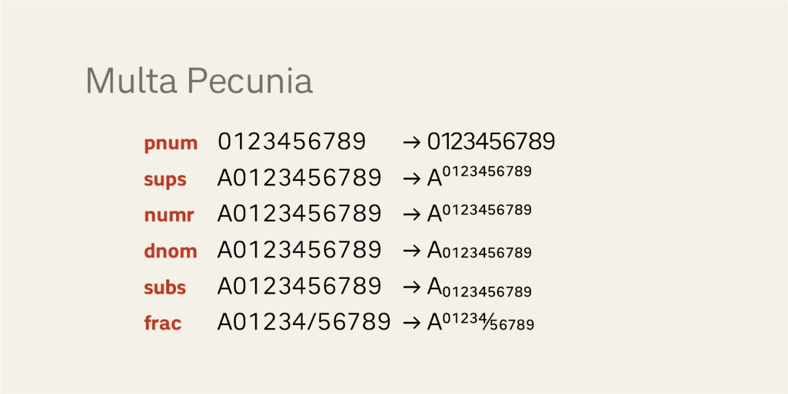

# Multa Pecunia
- Versione 1.116: aggiunte minori (e.g. ⁋, ❡).
- Versione 1.112: fix minori per kerning e posizioni.
- Versione 1.107: sistemazione numeri.
- Versione 1.0: versione iniziale.

Per maggiori informazioni e per testare il font, vedere la [pagina interattiva](https://m-casanova.github.io/MultaPecunia/).

## Utilizzo
Il font può essere utilizzato tramite un unico file in formato WOFF2 con il seguente codice CSS. Ovviamente il percorso del file deve essere adattato alla specifica situazione.

    @font-face {
        font-family: "Multa Pecunia";
        font-weight: 100 1000;
        src: url("MultaPecunia.woff2") format("woff2-variations");
    }

Per ottenere correttamente il corsivo con Chrome e Opera, utilizzare il seguente codice CSS.

    em, i { font-variation-settings: "ital" 1; font-style:normal }

## Descrizione

_Multa Pecunia_ è un font variabile derivato da _[Titillium Pro Display](https://github.com/pagopa/titillium-pro-display)_ di PagoPA (con alcune modifiche); il font _Multa Pecunia_ ha metriche compatibili con quelle di _[Pass A38](https://github.com/m-casanova/Pass-A38)_.

Il font variabile è rilasciato nei formati WOFF2 e TTF con licenza OFL 1.1.

## Opentype

